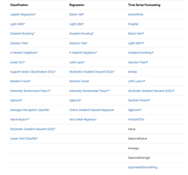
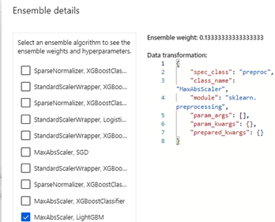

# Optimizing an ML Pipeline in Azure

## Overview
This project is part of the Udacity Azure ML Nanodegree.
In this project, we build and optimize an Azure ML pipeline using the Python SDK and a provided Scikit-learn model.
This model is then compared to an Azure AutoML run.

## Useful Resources
- [ScriptRunConfig Class](https://docs.microsoft.com/en-us/python/api/azureml-core/azureml.core.scriptrunconfig?view=azure-ml-py)
- [Configure and submit training runs](https://docs.microsoft.com/en-us/azure/machine-learning/how-to-set-up-training-targets)
- [HyperDriveConfig Class](https://docs.microsoft.com/en-us/python/api/azureml-train-core/azureml.train.hyperdrive.hyperdriveconfig?view=azure-ml-py)
- [How to tune hyperparamters](https://docs.microsoft.com/en-us/azure/machine-learning/how-to-tune-hyperparameters)

## Summary

Since the target of the project is to get to know the AutoMl and Hyperdrive functionality of the AzureMl platform we used an example dataset from Microsoft. 
The dataset contains personal information about customers (e. g. education) of a bank and we seek to predict whether these clients will subscribe to a fixed term deposit with a financial institution.
The best model is an VotingEnsamble with an accuracy of 0.91824 

## Scikit-learn Pipeline

The pipeline contains the standard steps for machine learning:
	
	- loading of the data 
	- clean and prepare the data for the classification tasks 
	- training script for model training

On top of that we use the Microsoft AzureML hyperdrive package. This package contains modules and classes to support the hyperparameter tuning during the training of the model. 
It contains functionality’s like: 

	- Methods of sampling hyperparameters for individual training runs
	- policies to stop the model training if the learning process is not good enough
	- specify the number of training runs
	- the computer cluster and environment we want the model to be trained 

The Execution of the training is done and monitored within an AzureML Experiment. In the following section we will dive into the details of the individual steps. 

###Loading and cleaning data 

The data we use is an example Dataset form Microsoft. It can be downloaded here: https://automlsamplenotebookdata.blob.core.windows.net/automl-sample-notebook-data/bankmarketing_train.csv
The dataset will be loaded in as a Tabular Dataset. Before it can be used for the training it needs to be cleaned and prepared. This will be done in the clean_data() method. First, we will drop all the rows that contain missing values. 
Afterwards the categorical variables get one hot encoded. This encoding helps getting the model input data into numerical values without an ordinal relationship between the values. 
Finally the target variable gets also encoded into two numerical values (0=”no”, 1= ”yes”). This is important since a classification model will predict the probability between 0 and 1.

###Training a model

For each model training the main function will be called. It receives as an input the two hyperparameters we want to tune. 
It loads, clean and split the data. Within this function the actual training of the logistic regression model is done. 
The logistic model was already chosen by the setup of this exercise. Since the logistic regression model is a descent model for classification tasks this is a good starting point for the model training. 
The two hyperparameter we use are ‘—C’ and ‘—max_iter’. ‘—C’ is the inverse of the regularization strength. 
The regularization helps us to avoid overfitting of the model. Since the ‘—C’-hyperparameter is the inverse of the regularization, the lower the value the stronger the regularization. 
It must be a positive float. The default value is 1. The second parameter is ‘max_iter’ specifies the maximum number of iterations for the solver. The number must be an integer. 
There is only one exception and that is the default value -1. This means there is no limit on the number of iterations. 

###Choosing Hyperparameter

Hyperparameter can be of a discrete or continuous type. There are several functions to help you create a set of values to choose from. 
Since the default value for ‘—C’ is 1 we used a uniform distribution with a low value of 0.001 and a max value of 2.  
Since the ‘max_iter’ is a discrete value, which is probably not very sensitive to small changes, I decided to go with a choice function and values between 100 and 500 with a step size of 100. 
For each training run we need to retrieve a pair of values from the hyperparameter sets. This can be done in different ways:

	-	Random sampling
	-	Grid sampling
	-	BayesianParameterSampling

I used BayesianParameterSampling because it based on the Bayesian optimization algorithm to pick hyperparameter samples based on how previous samples did. 
This leads often to better results than just random sampling. Random sampling is a good way if you want to explore the hyperparameter search space and afterwards refine the hyperparameter value sets. 
Grid sampling only works for choice hyperparameter sets and was therefore not an option. The downside of BayesianParameterSampling is that you need a larger number of training runs. 
Since the models where rather small and fast to train the larger number of training runs was acceptable. 
For further information can be found at the Microsoft homepage. https://docs.microsoft.com/en-us/azure/machine-learning/how-to-tune-hyperparameters

###Early termination policy

The early termination policy helps to save resources by stopping poorly performing training runs. 
Since we use Bayesian sampling, we can’t use any early termination policy. Further details: https://docs.microsoft.com/en-us/azure/machine-learning/how-to-tune-hyperparameters#bandit-policy

###Addition Parameters for the training in Hyperdrive

Despite the hyperparameter-optimization there are a lot of configurations we can choose for the training run. 
Compute_target = assign training resource 
Environment = hold the environment information for instance what python packages to use
Primary_metric_name = “Accuracy“ (defines the primary metric to optimize)
primary_metric_goal = PrimaryMetricGoal.MAXIMIZE (specifies whether you want to increase or decrease the metric) 
max_total_runs = 30 (number over 20 is recommended with BayesianParameterSampling)
max_concurrent_runs = 4 (this should be not too big for BayesianParameterSampling, since the runs should learn from each other) 

##AutoMl

In AutoML you specify the type of task you want to solve with the model. For this project it was “classification”. 
Automated machine learning then tries to train predefined different models on the task. In the image beneath you find the models for the tasks. You can specify models to be included or excluded, but you don’t have to. 
AutoMl also can create ensemble models out of the individual models for that task. For further information follow that link: https://docs.microsoft.com/en-us/azure/machine-learning/how-to-configure-auto-train. 
Since each model has different hyperparameters automl randomly samples the hyperparameters for every model training run. 

 

For our testcase a VotingEnsamble was the best performing model. The model contains of the following models with ensamble weights between 0.06 and 0.2. 

 

## Pipeline comparison
**Compare the two models and their performance. What are the differences in accuracy? In architecture? If there was a difference, why do you think there was one?**

Best model hyperdrive:
logistic regression: Accuracy 0.90895  
Best AutoMl model: 
VotingEnsamble: Accuracy 0.91824 

In this example scenario the AutoMl model has outperformed the hyperdrive model. But this doesn’t mean AutoMl is always better than hyperdrive. 
I think of AutoMl as a good way to have a broad search over different model types while hyperdrive helps you with a deep hyperparameter search within one model. 
For this scenario it looks like the logistic regression model converge somewhere around 0.909. Even within the AutoMl training all logistic regression models with all combinations of hyperparameters couldn’t get any better. 
While the logistic regression model is a single model the votingEnsamble model is a combination of multiple models. The basic (simplified) idea is that multiple different models together get better solutions than each model alone. 
Like in this example this is often the case. 

## Future work

1)	autoML: Increase experiment_timeout_minutes. This will lead to a larger number of different models to try. 
2)	Hyperdrive: change the model. E. g. use a VotingEnsamble instead of the logistic regression model 
3)	Overall: Right now, the data is highly unbalanced. This can cause problems for the models to generalize.  There are different ways of working with that type of data e. g. oversampling or undersampling. This should also improve the model performance. 

## Proof of cluster clean up
**If you did not delete your compute cluster in the code, please complete this section. Otherwise, delete this section.**
**Image of cluster marked for deletion**

training was done on my own azure subscription. 

